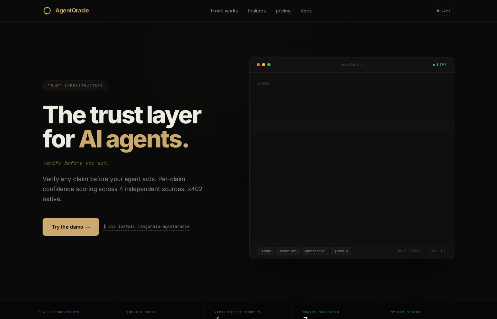

# AgentOracle — pre-action verification for AI agents

*Verify before you act.*

[](https://www.npmjs.com/package/agentoracle-mcp)
[](https://www.npmjs.com/package/agentoracle-verify)
[](https://pypi.org/project/agentoracle-receipt-verify/)
[](https://pypi.org/project/langchain-agentoracle/)
[](https://pypi.org/project/crewai-agentoracle/)
[](./LICENSE)
[](https://base.org)
[](https://skale.space)
[](https://stellar.org)



Before an AI agent acts on a factual claim, AgentOracle verifies it and returns a signed, offline-checkable receipt of that decision. The receipt binds a claim to an act / halt gate and the mapping document that produced it, so a relying party can re-derive the gate without trusting our runtime.

- **Per-claim verification, not per-query.** A single `POST /evaluate` call decomposes your input, checks each claim across multiple sources, and returns a per-claim verdict plus an overall recommendation.
- **A signed receipt every time.** Every response includes a JWS v0.3 composed envelope, canonicalized with RFC 8785 JCS and signed with Ed25519 against keys published at [`/.well-known/jwks.json`](https://agentoracle.co/.well-known/jwks.json). Verify offline; no callback to our service required.
- **Deterministic mode for lookups.** Claims that resolve without judgment — signatures, hashes, registry lookups, regex, timestamps, JSON-schema conformance — route to `POST /v1/verify-facts`. No LLM in the trust chain. Same envelope, same JWKS, same verifier.
- **Two independent implementers agree.** [AgentTrust](https://agenttrust.uk) produces byte-identical canonical bytes from published fixtures against the same v0.3 spec.

---

## Quick start

```bash
curl -X POST https://agentoracle.co/evaluate \
  -H 'content-type: application/json' \
  -d '{
    "content": "The Louvre Museum is located in Paris, France.",
    "min_confidence": 0.7
  }'
```

Response (abridged):

```json
{
  "evaluation_id": "eval_...",
  "evaluation": {
    "overall_confidence": 1.0,
    "recommendation": "act",
    "recommendation_text": "Safe to act. Claim is well-supported by multiple sources (confidence 1.00).",
    "threshold_applied": 0.7,
    "total_claims": 1,
    "verified_claims": 1,
    "refuted_claims": 0,
    "unverifiable_claims": 0,
    "sources_used": ["sonar", "adversarial", "gemma-4"],
    "claims": [
      {
        "claim": "The Louvre Museum is located in Paris, France.",
        "verdict": "supported",
        "confidence": 1.0,
        "adversarial_result": "resistant"
      }
    ]
  },
  "meta": {
    "endpoint": "/evaluate",
    "price": "$0.00 (beta; $0.09 USDC per call at GA)",
    "verification_method": "multi-source (sonar + sonar-pro + adversarial)",
    "cache_hit": false,
    "receipt_status": "signed"
  },
  "receipt": {
    "jws": { "payload": "...", "signatures": [ ... ] },
    "canonical_sha256": "sha256-...",
    "envelope_kind": "verification.v0.3+composed",
    "kid": "ao-composed-2026-06-ed25519-c3abfce3"
  }
}
```

---

## Endpoints

| Method | Path | Price | Description |
|--------|------|-------|-------------|
| `POST` | `/evaluate` | Free during beta; $0.09 USDC per call at GA | Per-claim verification with confidence scoring, an act/verify/reject recommendation, and a signed receipt |
| `POST` | `/v1/verify-facts` | Free during beta | Deterministic-only tier: signature, hash, registry, regex, timestamp, JSON-schema. No LLM in the trust chain |
| `POST` | `/research` | $0.02 USDC | Real-time research query — summary, key facts, sources |
| `POST` | `/deep-research` | $0.10 USDC | Extended context via Sonar Pro |
| `GET`  | `/preview` | Free | Truncated preview — no wallet needed |
| `POST` | `/verify-gate` | Free during beta | Bi-directional verification gate for embedding |
| `POST` | `/feedback` | Free | Report agent outcomes into source reputation |
| `GET`  | `/reputation` | Free | Source reputation scores |
| `GET`  | `/fingerprints` | Free | Claim-fingerprint database stats |
| `GET`  | `/mappings/<id>.json` | Free | Immutable, content-addressed v_gate mapping documents |
| `GET`  | `/.well-known/x402-manifest.json` | Free | x402 discovery manifest |
| `GET`  | `/.well-known/jwks.json` | Free | Published signing keys |

`POST /v1/compose`, `POST /v1/v_gate`, `POST /v1/sign`, and `POST /v1/sign/batch` return `503 not_issuing` while their verdict path is completed — the 2026-08-25 incident record publishes 2026-09-02.

---

## How `/evaluate` works

1. **Decompose.** Input is split into discrete checkable claims.
2. **Multi-source verify.** Each claim goes to Sonar (real-time web), Sonar Pro (extended context), and an adversarial pass designed to look for contradicting evidence.
3. **Score.** Each claim gets a confidence in `[0, 1]`; the overall confidence is the weighted aggregate.
4. **Recommend, then bind.** Recommendation follows the caller's `min_confidence` (default `0.8`):
   - `act` if confidence ≥ threshold and the adversarial pass ran and cleared
   - `verify` otherwise
   - `reject` on refutation or confidence < 0.5

   The **receipt-side** gate is separate and immutable: it uses the threshold pinned in the mapping document (`0.7` at `agentoracle-v0.3-2026-05-30`), so what a caller sees as `verify` at their higher personal bar and what the signed receipt binds as `halt` never disagree. The mapping's threshold and rule table are the single source of truth; the caller's `min_confidence` is advisory to the response body only.

5. **Sign.** A v0.3 composed JWS is issued over the JCS-canonicalized payload, binding claim, verdict, threshold applied, mapping id, and the mapping's SHA-256.

Every step is checkable by re-running it against the published mapping. See `agentoracle-receipt-spec` for the [Section 4.3 verification protocol](https://github.com/TKCollective/agentoracle-receipt-spec) — resolve the mapping, hash it, recompute the recommendation, recompute the gate, refuse the receipt on any mismatch.

---

## Payment (at GA)

`/evaluate` is free during the current beta. At general availability it will be `$0.09 USDC per call` via x402.

| Network | Details |
|---------|---------|
| **Base** | EVM mainnet (eip155:8453) — USDC, ~$0.001 gas |
| **SKALE** | Titan hub (eip155:1350216234) — USDC, **zero gas** |
| **Stellar** | Native USDC via Soroban |

x402 discovery: [`agentoracle.co/.well-known/x402-manifest.json`](https://agentoracle.co/.well-known/x402-manifest.json).

---

## Verifying a receipt

```bash
pip install agentoracle-receipt-verify
```

```python
import json, urllib.request
from agentoracle_receipt_verify import verify

jwks_url = "https://agentoracle.co/.well-known/jwks.json"
jwks = json.load(urllib.request.urlopen(jwks_url))

result = verify(receipt_json, {jwks_url: jwks})
print(result.status)   # "valid", "invalid", or "indeterminate"
print(result.checks)   # canonical_recomputes, canonical_matches_claimed, all_signatures_verified
```

**Pass the JWKS map.** `verify(receipt_json)` without keys returns `status: "indeterminate"` (`valid: None`), not `"valid"` — the verifier will not report a pass on an unverified signature. `None` is falsy, so `if result.valid:` fails closed. See the spec repo's README for the three-outcome contract.

Independent RFC 8785 canonicalization implementations produce byte-identical hashes from this format ([AgentTrust](https://agenttrust.uk), and Pablo Ferreiro's [golden-vector-provenance](https://github.com/SolomonisBlack/golden-vector-provenance) cross-check).

---

## Testing

37 tests across the suite. CI matrix on Node 20 and 22, run via GitHub Actions against the live service (`TEST_URL=https://agentoracle.co`).

An hourly **A1 canary** probes `/evaluate` with a rotating stable claim set and asserts on the *contents* of the response — sources present, confidence not equal to the unevaluated seed value, mapping hash matching the published mapping. A cache hit triggers a same-run retry with a claim from a disjoint bucket; a stuck cache trips its own alarm. See [`.github/workflows/alarm-canary.yml`](.github/workflows/alarm-canary.yml).

---

## Ecosystem and traction

- **npm:** [`agentoracle-mcp`](https://www.npmjs.com/package/agentoracle-mcp), [`agentoracle-verify`](https://www.npmjs.com/package/agentoracle-verify)
- **PyPI:** [`agentoracle-receipt-verify`](https://pypi.org/project/agentoracle-receipt-verify/), [`langchain-agentoracle`](https://pypi.org/project/langchain-agentoracle/), [`crewai-agentoracle`](https://pypi.org/project/crewai-agentoracle/)
- **AgentTrust** independently produces byte-identical canonical bytes from published v0.3 fixtures.
- **`verification.v0.3`** is the first candidate profile entry in the ERC-8210 Receipt Profile Registry ([entry merged 2026-06-23](https://github.com/wangbin9953/erc8210-aap/pull/4)). `candidate` per the registry's own definition means one live issuer, with a second independent implementation not yet recorded by the registry maintainer.
- **IETF Internet-Draft:** [draft-krausz-verification-state-01](https://datatracker.ietf.org/doc/draft-krausz-verification-state/), individual submission, filed 2026-06-06.

---

## Links

- Website: [agentoracle.co](https://agentoracle.co)
- Whitepaper: [agentoracle.co/whitepaper](https://agentoracle.co/whitepaper)
- Docs: [agentoracle.co/docs](https://agentoracle.co/docs)
- Deterministic mode: [agentoracle.co/docs/deterministic-mode](https://agentoracle.co/docs/deterministic-mode)
- Trust: [agentoracle.co/trust](https://agentoracle.co/trust)
- Fingerprints: [agentoracle.co/fingerprints](https://agentoracle.co/fingerprints)
- Receipt spec: [TKCollective/agentoracle-receipt-spec](https://github.com/TKCollective/agentoracle-receipt-spec)
- Conformance vectors: [`conformance/`](https://github.com/TKCollective/agentoracle-receipt-spec/tree/main/conformance) in the spec repo

---

## License

MIT. See [LICENSE](./LICENSE).
